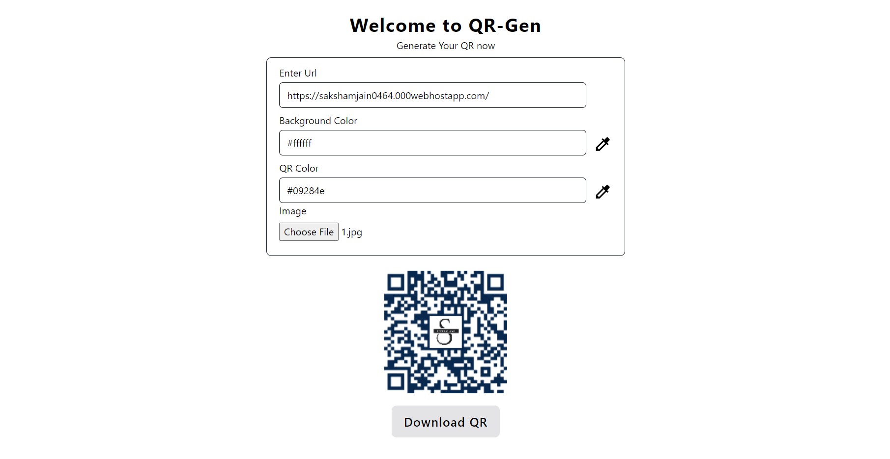

# QR-gen

QR-gen is a QR code generator app built with React and Tailwind CSS. It allows users to create high-quality QR codes with customizable color schemes and the option to add logos.

## Features

- **Customizable Color Schemes**: Choose your preferred color scheme for your QR codes.
- **Logo Integration**: Personalize your QR codes by adding your own logo.
- **Seamless Downloading**: Download your generated QR codes for immediate use.

## Technologies Used

- React
- Tailwind CSS
- npm packages:
  - react-icons
  - qrcode.react

## Demo



## Sample QR


## Deployment

The app is deployed [here](https://sakshamjain0464.github.io/qr-gen/).

## Installation

To run the project locally, follow these steps:

1. Clone the repository:
```bash
git clone https://github.com/your_username/QR-gen.git
```
2. Navigate to the project directory:
```bash
cd QR-gen
```
3. Install dependencies:
```bash
npm install
```
4. Start the development server:
```bash
npm run dev
```

## Contributing

Contributions are welcome! Please feel free to submit pull requests.


